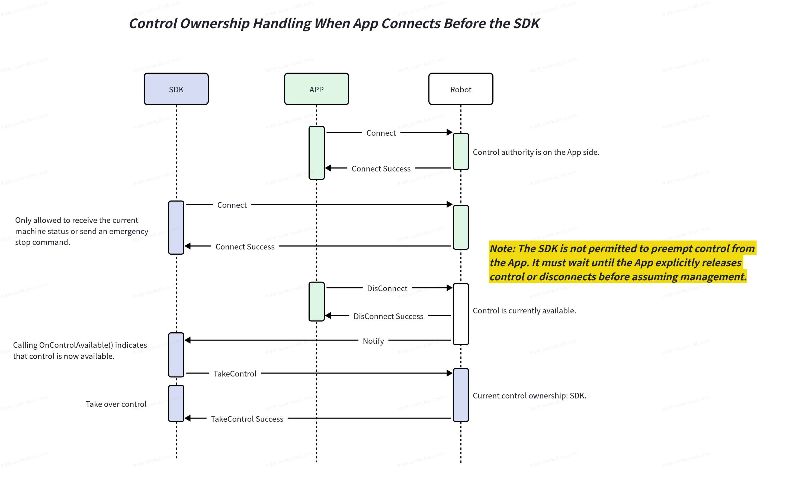

## Control Authority Between SDK and App ##

**Principles**

**1.The App is allowed to preempt the SDK's control authority.**

**2.The SDK is not allowed to preempt the App's control authority.**

### Scenario 1: The App Connects First, Followed by the SDK. Control authority is held by the App, and the SDK cannot control the robot. ###

### Scenario 2: The SDK Connects First, Followed by the App. Control authority is held by the SDK. The App cannot control the robot, but it can forcibly preempt the SDK's control authority. ###

