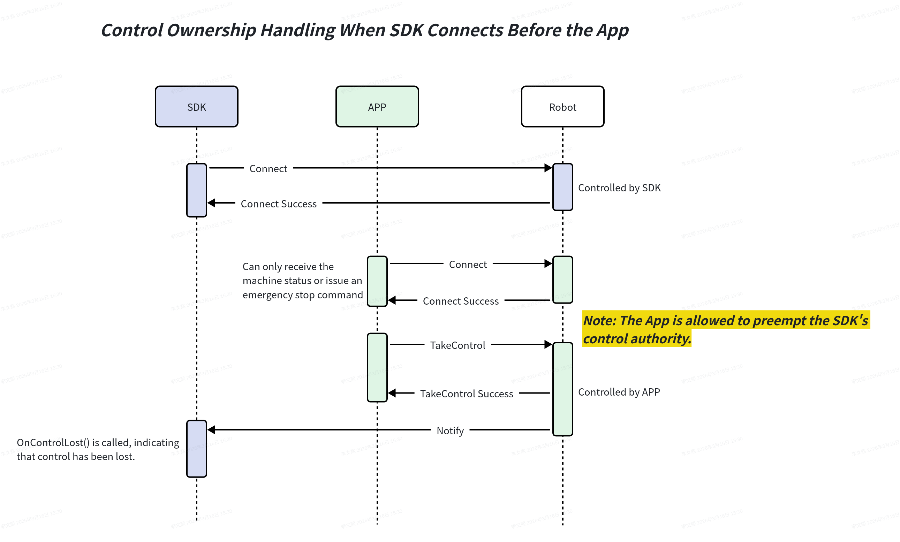

## SDK and App Control Ownership

**Principles**

**1. The App is allowed to preempt control ownership from the SDK.**

**2. The SDK is not allowed to preempt control ownership from the App.**

### Scenario 1: The App connects first, and then the SDK connects. Control ownership belongs to the App, so the SDK cannot control the robot.

### Scenario 2: The SDK connects first, and then the App connects. Control ownership belongs to the SDK, so the App cannot control the robot initially, but it can forcibly take control from the SDK.

