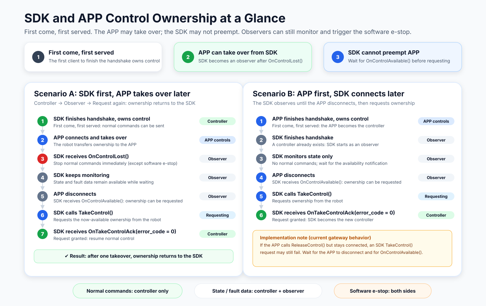
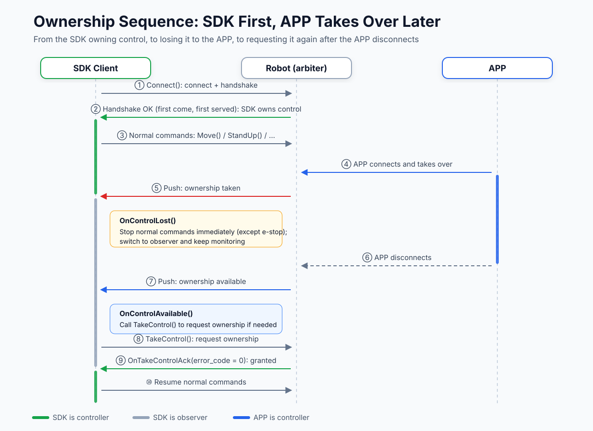
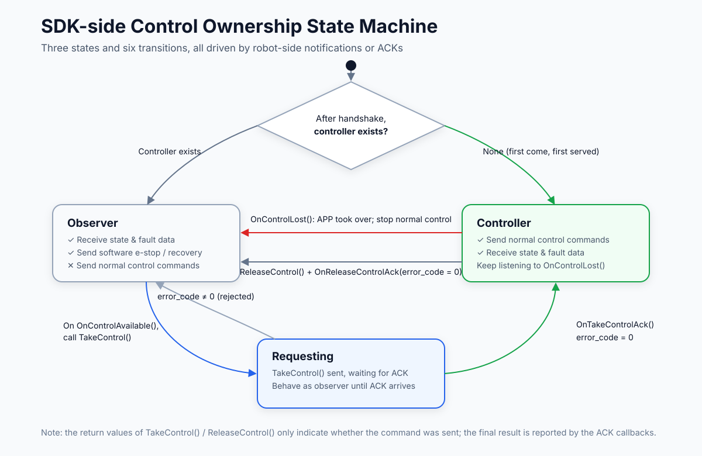

# SDK and APP Control Ownership

## What Is Control Ownership

Control ownership determines **which client may send normal control commands** (motion, tasks, device control, etc.) to the robot.

Think of the robot as a car: **ownership is the steering wheel, and only one client can hold it at a time** — that client is the **controller**. Every other connected client is an **observer** who can only watch the dashboard (state and fault data). However, anyone can hit the "emergency stop button" at any time: the software e-stop is not restricted by ownership.

Two concepts that are easy to confuse:

- **Connected / handshake completed** only means "the client is connected to the robot"; it does not imply ownership.
- **Control ownership** is arbitrated by the robot. Clients can only request it; they cannot seize it by force (except the APP).

## Core Rules

| # | Rule | Description |
|:--|:--|:--|
| 1 | First come, first served | The first client to finish the handshake owns control; later clients become observers |
| 2 | APP may take over from SDK | The APP can actively take control after connecting; the SDK receives `OnControlLost()` |
| 3 | SDK cannot preempt APP | As long as the APP stays connected, an SDK `TakeControl()` request fails |
| 4 | Ownership becomes available after the controller disconnects | The SDK may call `TakeControl()` only after receiving `OnControlAvailable()` |
| 5 | Stop immediately when ownership is lost | After `OnControlLost()`, stop sending normal control commands at once |

## How Ownership Transitions

The sequence below uses "SDK connects first, APP takes over later" as an example:

Key points:

- **Step ②**: First-come-first-served is automatic; the SDK does not need to call `TakeControl()` explicitly.
- **Step ⑤**: A takeover is a **passive notification**. The SDK must implement `OnControlLost()`, otherwise it risks believing it is still in control.
- **Steps ⑧⑨**: `TakeControl()` is only a request. The result is determined by `error_code` in `OnTakeControlAck()`.

## SDK-side State Machine and Recommended Flow

At any moment, the SDK is in exactly one of three states. Every transition is driven by a robot-side notification or ACK:

Recommended handling in application code:

1. After connecting, register `OnControlLost()`, `OnControlAvailable()`, `OnTakeControlAck()`, and `OnReleaseControlAck()`.
2. Track ownership with a boolean flag (e.g. `has_control_`) and **send normal control commands only while the flag is set**.
3. On `OnControlLost()`: clear the flag, immediately stop all normal control commands (including any periodic velocity loop), and switch to observer mode.
4. On `OnControlAvailable()`: call `TakeControl()` if the application needs control.
5. On `OnTakeControlAck()` with `error_code == 0`: set the flag and resume normal control.

## Controller vs. Observer Permissions

| Capability | Controller | Observer |
|:--|:--:|:--:|
| Send normal commands (motion, tasks, device control) | ✓ | ✕ |
| Receive robot state and fault data | ✓ | ✓ |
| Send software e-stop / recovery commands | ✓ | ✓ |

> An observer is not useless: it can still monitor state and faults and perform emergency safety operations.

## Related APIs and Callbacks

### Active APIs

| API | Purpose |
|:--|:--|
| `TakeControl()` | Requests currently available ownership; see [TakeControl](sdk_client_api_en.md) |
| `ReleaseControl()` | Lets the current controller release ownership; see [ReleaseControl](sdk_client_api_en.md) |

### Result Callbacks (`IControlCallback`)

| Callback | Purpose |
|:--|:--|
| `OnTakeControlAck(const TakeControlAck& ack)` | Request result; success only when `ack.error_code == 0`, with the failure reason in `ack.reason` |
| `OnReleaseControlAck(const ReleaseControlAck& ack)` | Release result; success only when `ack.error_code == 0` |

### Event Notifications (`IDataCallback`)

| Callback | Trigger |
|:--|:--|
| `OnControlLost(const ControlLostInfo& info)` | Ownership was taken by another client (e.g. the APP) |
| `OnControlAvailable(const ControlAvailableInfo& info)` | Ownership became available (usually because the controller disconnected) |

> **Important:** the return values of `TakeControl()` / `ReleaseControl()` only indicate whether the command was **sent** successfully. Application logic must treat the `error_code` in the corresponding ACK callback as the final result.

### Auxiliary Check: Who Owns Control Now

The periodically reported `RobotState` contains the `control_source` field (`CtrlSource::CTRL_SOURCE_APP` / `CTRL_SOURCE_SDK` / ...), which can be used to passively confirm the current controller — useful for UI display or consistency checks. See [RobotState](sdk_type_en.md).

## Notes

1. **APP releasing without disconnecting ≠ ownership available** (current gateway behavior): if the APP calls `ReleaseControl()` but stays connected, the gateway still treats it as a connected APP, and an SDK `TakeControl()` request may fail. The reliable approach is to wait for the APP to disconnect and for `OnControlAvailable()` before requesting ownership.
2. **Re-confirm ownership after reconnection**: ownership may have changed while the link was down. After a successful reconnect, rely on the callbacks instead of assuming the previous ownership is still held.
3. **The software e-stop is not restricted by ownership**: observers may also send software e-stop and recovery commands, so safety logic does not need to wait for ownership.

## Reference Example

See `example/take_control.cpp` for a complete runnable demo covering:

- Triggering `TakeControl()` from a background thread on `OnControlAvailable()`;
- Confirming the request result via `OnTakeControlAck()`;
- Watching controller changes in real time via `RobotState.control_source`;
- Detecting APP takeovers via `OnControlLost()`.
