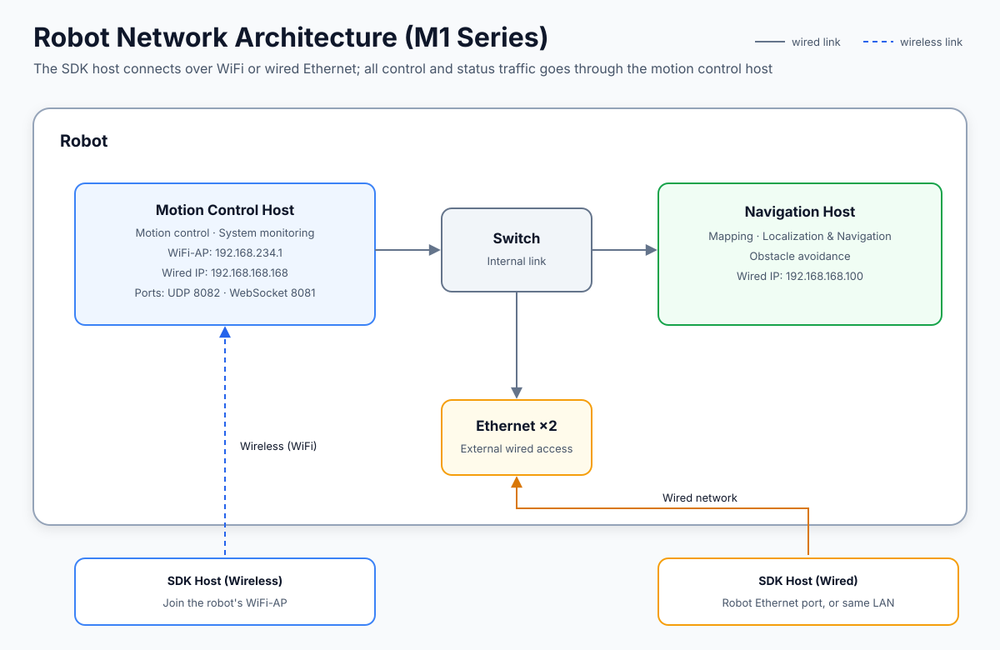

# SDK Network Architecture

> Scope: **M1 series (medium dog)**. The network architecture of the L2 series (small dog) will be documented in a future release.

## Onboard Network Components

| Component | Responsibilities | Wired IP |
|:--|:--|:--|
| Motion Control Host | Motion control and system status monitoring; all SDK control commands and status data are exchanged with it | `192.168.168.168` |
| Navigation Host | Mapping, localization & navigation, and obstacle avoidance | `192.168.168.100` |
| Switch | Internal interconnect between the two hosts and the external Ethernet ports | — |
| Ethernet ×2 | External wired network access | Assigned by the LAN |

## Connecting the SDK Host

- **Wireless**: join the robot's WiFi-AP; the motion control host's AP address is `192.168.234.1`.
- **Wired**: connect through the robot's Ethernet port, on the same LAN as the robot.
- **Communication ports** (motion control host): UDP `8082`, WebSocket `8081`.

A wired connection is recommended for lower latency and better stability.
