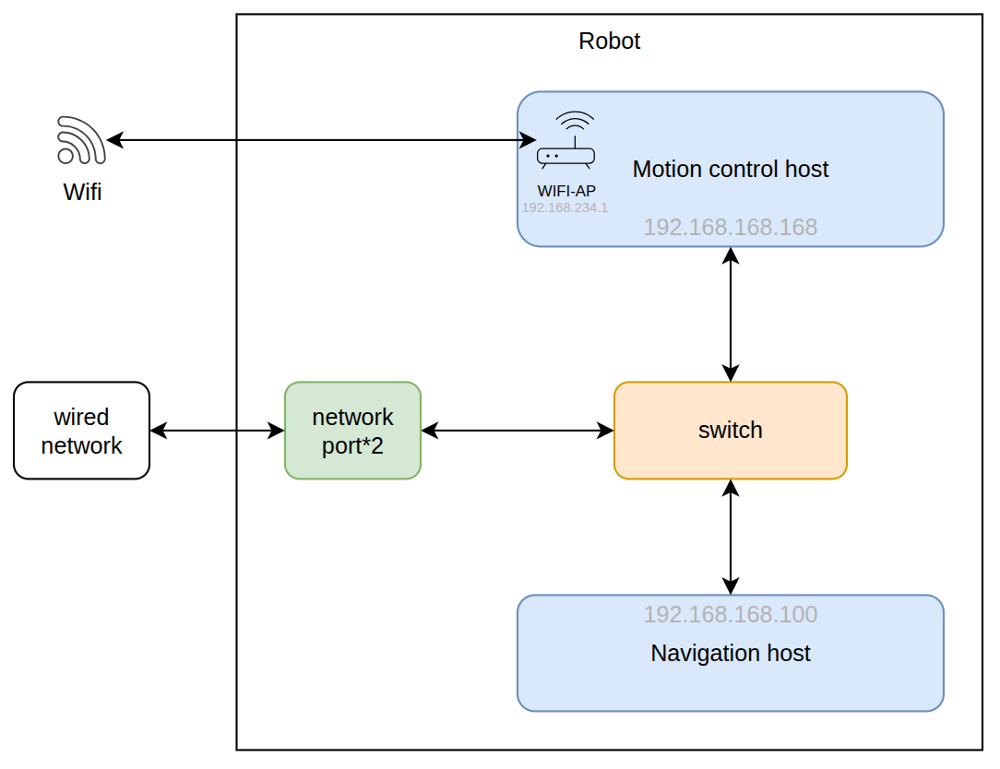

# Robot SDK — Network Structure Description

**The system provides both wired and wireless connections. Wired network access is recommended.**

Internal components include a motion control host and a navigation host:

1. Motion Control Host: Responsible for basic platform functions such as motion control and system monitoring;

2. Navigation Host: Responsible for perception functions such as mapping, localization and navigation, obstacle avoidance, and autonomous charging;

The network architecture between the hosts is shown in the diagram below.

