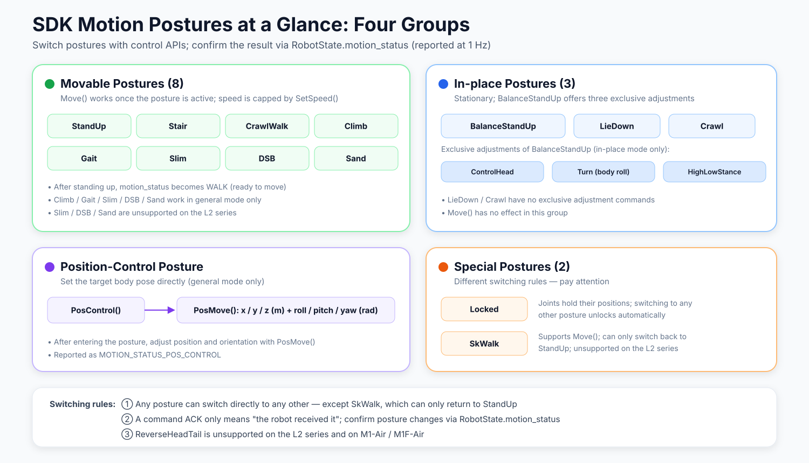
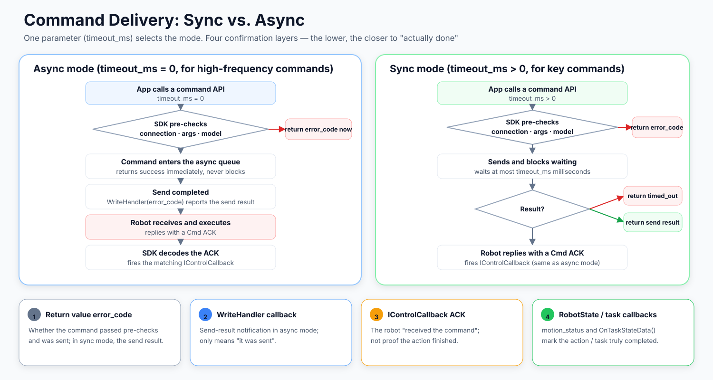

# SDK Motion States and Command Delivery

## What Is a Motion State (MotionStatus)

Think of a "posture" as the robot body's **working mode**: standing, lying down, crawling,
position control... The robot is in exactly one posture at a time, and the posture determines
**which motion commands it can respond to**.

- **Switch postures**: call posture control APIs such as `StandUp()`, `LieDown()`, `PosControl()`
- **Observe the posture**: read `RobotState::motion_status` (actively reported by the robot
  at 1 Hz after connecting, no configuration needed)

> **Key insight: a command ACK ≠ the posture change completed.**
> Receiving `OnStandUp()` only means the robot "received the stand-up command".
> Whether the posture actually changed is determined by `RobotState::motion_status`.
> For example, once the robot finishes standing, the reported state is `MOTION_STATUS_WALK`
> ("standing and ready to walk"), not `MOTION_STATUS_STAND_UP`.

## Posture Capability Matrix

| Posture | Switch API | Reported MotionStatus | Mobility | Exclusive Capabilities / Notes |
|:--|:--|:--|:--|:--|
| Stand up | `StandUp()` | `STAND_UP` → `WALK` | `Move()` | Becomes ready to walk when done |
| Balance stand | `BalanceStandUp()` | `BALANCE_STAND` | — | `ControlHead()` / `Turn()` / `HighLowStance()` (in-place mode) |
| Lie down | `LieDown()` | `LIE_DOWN` | — | — |
| Stair | `Stair()` | `STAIR` | `Move()` | — |
| Crawl | `Crawl()` | `CRAWL` | — | — |
| Crawl walk | `CrawlWalk()` | `CRAWL_WALK` | `Move()` | — |
| Climb | `Climb()` | `CLIMB` | `Move()` | General mode only |
| Gait | `Gait()` | `GAIT` | `Move()` | General mode only |
| Slim (narrow passage) | `Slim()` | `SLIM` | `Move()` | General mode only; unsupported on the L2 series |
| DSB | `DSB()` | `DSB` | `Move()` | General mode only; unsupported on the L2 series |
| Position control | `PosControl()` | `POS_CONTROL` | `PosMove()` | General mode only |
| SameKnee walk | `SkWalk()` | `SK_WALK` | `Move()` | General mode only; **can only switch back to `StandUp`**; unsupported on the L2 series |
| Sand | `Sand()` | `SAND` | `Move()` | General mode only; wire protocol `action/snow`; unsupported on the L2 series |
| Locked | `Locked()` | `LOCKED` | — | Switching to any other posture unlocks automatically |

> Calling an unsupported API on an L2-series robot does not send any command; the SDK returns
> `robot_sdk::Errc::UnsupportedDeviceOperation` immediately. Per-model support is listed in the
> [API capability matrix](sdk_api_capability_en.md).

## Posture Switching Rules

1. **Any posture can switch directly to any other** — no need to return to StandUp first.
   The only exception is `SkWalk`, which can only switch back to `StandUp`.
2. **Locked**: switching to any other posture unlocks automatically; no separate unlock command exists.
3. **Standing up reports `WALK` when done**: `STAND_UP` only appears while the robot is
   still in the standing-up process.
4. **`ReverseHeadTail` model restriction**: unsupported on the L2 series and on
   `DeviceType::M1_AIR` / `DeviceType::M1F_AIR`.
5. **Sand posture protocol note**: the wire action is `action/snow`; when the device reports
   the `snow` state, the SDK parses it as `MOTION_STATUS_SAND`.

## Command Delivery and Result Confirmation

Every command API selects its working mode through a single parameter, `timeout_ms`:

| | Async Mode | Sync Mode |
|:--|:--|:--|
| Parameter | `timeout_ms = 0` (default) | `timeout_ms > 0` |
| Behavior | Returns immediately, never blocks | Blocks until the send completes or times out |
| Return value means | Whether the command passed pre-checks and was accepted | The send result itself |
| Send-result notification | `WriteHandler` callback | The return value |
| Typical use | High-frequency commands (e.g. periodic `Move`), inside callbacks | Low-frequency key commands (e.g. posture switches) |

Result confirmation has four layers — **the lower, the closer to "actually done"**:

1. **Return value `error_code`**: whether the command passed SDK pre-checks (connection state,
   argument validity, model capability) and was sent.
2. **`WriteHandler` callback**: async-mode send completion notification — still only means "sent".
3. **`IControlCallback` ACK**: the robot confirmed it "received the command" — not that the
   action finished executing.
4. **`RobotState` / `OnTaskStateData()`**: actual changes in posture and task state —
   the action truly completed.

> **Never use sync mode inside a callback**: the synchronous wait needs the I/O thread to
> process subsequent events, but the callback itself runs on that thread — this deadlocks.
> See the [Callback Reference](sdk_callback_en.md).

## Related Documents

- [SDKClient API Reference](sdk_client_api_en.md) — Parameters and return values of all control APIs
- [Callback Reference](sdk_callback_en.md) — ACK and report callback list
- [Data Types Reference](sdk_type_en.md) — `MotionStatus`, `MachineStatus`, and other state enums
- [API Capability Matrix](sdk_api_capability_en.md) — Per-model API support
