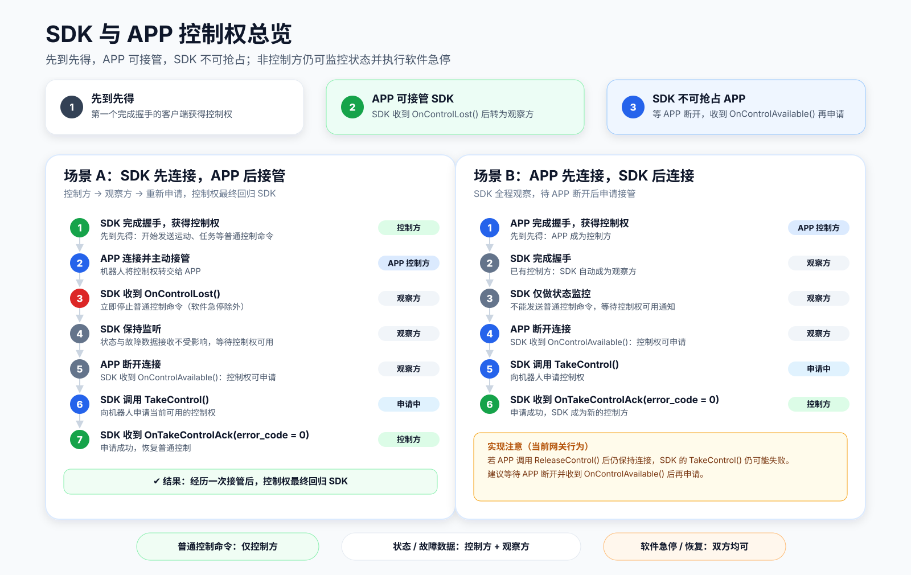
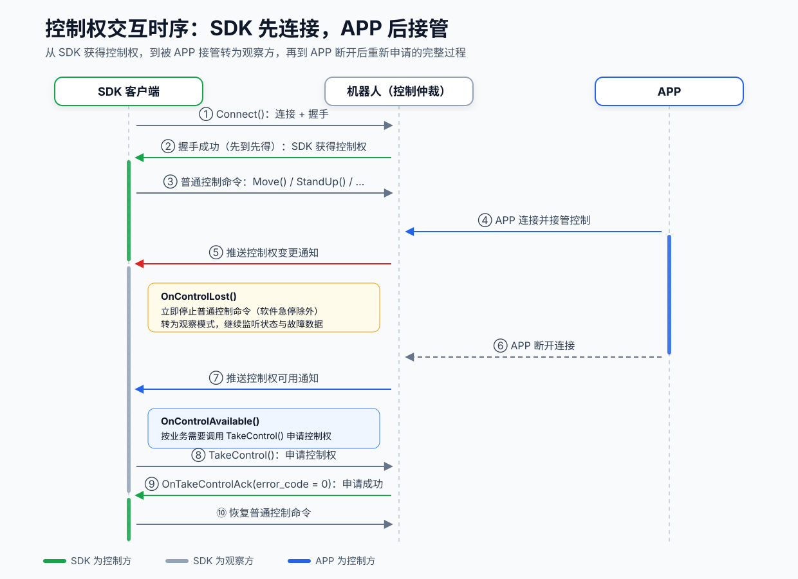
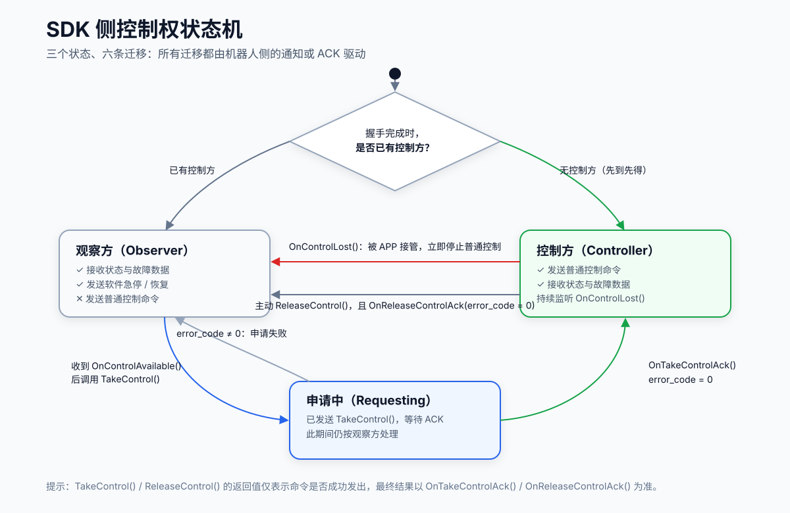

# SDK 与 APP 控制权说明

## 什么是控制权

控制权决定**谁可以向机器人发送普通控制命令**（运动、任务、设备控制等）。

可以把机器人想象成一辆车：**控制权就是方向盘，同一时间只有一个客户端能握住它**——这个客户端称为**控制方**；其他已连接的客户端都是**观察方**，只能看仪表盘（接收状态与故障数据）。但无论是谁，紧急时刻都能拍下"急停按钮"（软件急停不受控制权限制）。

两个容易混淆的概念：

- **连接 / 握手成功**：只表示"连上了机器人"，不代表拥有控制权。
- **控制权**：由机器人统一仲裁，按规则分配和转移，客户端只能申请，不能强制夺取（APP 除外）。

## 核心规则

| # | 规则 | 说明 |
|:--|:--|:--|
| 1 | 先到先得 | 第一个完成握手的客户端自动获得控制权，后连接者成为观察方 |
| 2 | APP 可接管 SDK | APP 连接后可主动接管，SDK 会收到 `OnControlLost()` |
| 3 | SDK 不可抢占 APP | 只要 APP 保持连接，SDK 的 `TakeControl()` 请求会失败 |
| 4 | 控制方断开后控制权可用 | SDK 收到 `OnControlAvailable()` 后才能调用 `TakeControl()` 申请 |
| 5 | 失去控制权必须立即停手 | 收到 `OnControlLost()` 后应立即停止发送普通控制命令 |

## 控制权如何流转

下图以"SDK 先连接、APP 后接管"为例，展示完整的交互时序：

关键点解读：

- **步骤 ②**：先到先得是自动完成的，SDK 无需显式调用 `TakeControl()`。
- **步骤 ⑤**：被接管是**被动通知**，SDK 必须实现 `OnControlLost()` 回调，否则会出现"以为自己还在控制"的危险状态。
- **步骤 ⑧⑨**：`TakeControl()` 只是"申请"，是否成功以 `OnTakeControlAck()` 的 `error_code` 为准。

## SDK 侧状态机与推荐处理流程

SDK 在任一时刻都处于以下三个状态之一，所有状态迁移都由机器人侧的通知或 ACK 驱动：

推荐在业务代码中按以下流程处理：

1. 连接后注册 `OnControlLost()`、`OnControlAvailable()`、`OnTakeControlAck()`、`OnReleaseControlAck()` 四个回调。
2. 用一个布尔标志（如 `has_control_`）记录当前是否拥有控制权，**仅在拥有控制权时才发送普通控制命令**。
3. 收到 `OnControlLost()` → 清除标志，立即停止普通控制命令（含定时发送的速度命令），转为观察模式。
4. 收到 `OnControlAvailable()` → 按业务需要调用 `TakeControl()`。
5. 收到 `OnTakeControlAck()` 且 `error_code == 0` → 置位标志，恢复普通控制。

## 控制方与观察方权限对照

| 能力 | 控制方 | 观察方 |
|:--|:--:|:--:|
| 发送普通控制命令（运动、任务、设备控制等） | ✓ | ✕ |
| 接收机器人状态与故障数据 | ✓ | ✓ |
| 发送软件急停 / 急停恢复命令 | ✓ | ✓ |

> 观察方并非"完全不可用"：它仍可用于状态监控、故障告警和紧急安全操作。

## 相关接口与回调

### 主动接口

| 接口 | 用途 |
|:--|:--|
| `TakeControl()` | 申请当前可用的控制权，详见 [TakeControl](sdk_client_api_zh.md#takecontrol---获取控制权) |
| `ReleaseControl()` | 当前控制方主动释放控制权，详见 [ReleaseControl](sdk_client_api_zh.md#releasecontrol---释放控制权) |

### 结果回调（`IControlCallback`）

| 回调 | 用途 |
|:--|:--|
| `OnTakeControlAck(const TakeControlAck& ack)` | 申请结果；`ack.error_code == 0` 才表示成功，失败原因见 `ack.reason` |
| `OnReleaseControlAck(const ReleaseControlAck& ack)` | 释放结果；`ack.error_code == 0` 才表示成功 |

### 事件通知（`IDataCallback`）

| 回调 | 触发时机 |
|:--|:--|
| `OnControlLost(const ControlLostInfo& info)` | 控制权被其他客户端（如 APP）接管 |
| `OnControlAvailable(const ControlAvailableInfo& info)` | 控制权变为可申请（通常是控制方断开） |

> **重要：** `TakeControl()` / `ReleaseControl()` 的函数返回值仅表示命令是否成功**发出**，
> 不代表控制权申请结果。业务逻辑必须以对应 ACK 回调中的 `error_code` 为最终依据。

### 辅助判断：当前控制方是谁

机器人周期性上报的 `RobotState` 中包含 `control_source` 字段（`CtrlSource::CTRL_SOURCE_APP` / `CTRL_SOURCE_SDK` / …），
可用来被动确认当前控制方归属，适合在界面上展示或做一致性校验，详见 [RobotState](sdk_type_zh.md)。

## 注意事项

1. **APP 释放但不断开 ≠ 控制权可用**（当前网关行为）：若 APP 调用 `ReleaseControl()` 后仍保持连接，
   网关仍将其视为已连接的 APP，此时 SDK 的 `TakeControl()` 可能失败。
   可靠的做法是等待 APP 断开并收到 `OnControlAvailable()` 后再申请。
2. **断线重连后需重新确认控制权**：连接中断后控制权归属可能已变化，重连成功后应以回调通知为准，
   不要假设仍持有断线前的控制权。
3. **软件急停不受控制权限制**：观察方也可以发送软件急停与恢复命令，安全逻辑无需等待获得控制权。

## 参考示例

完整可运行的示例见 `example/take_control.cpp`，演示了：

- 通过 `OnControlAvailable()` 触发后台线程自动调用 `TakeControl()`；
- 通过 `OnTakeControlAck()` 确认申请结果；
- 通过 `RobotState.control_source` 实时观察控制方变化；
- 通过 `OnControlLost()` 感知被 APP 接管。
