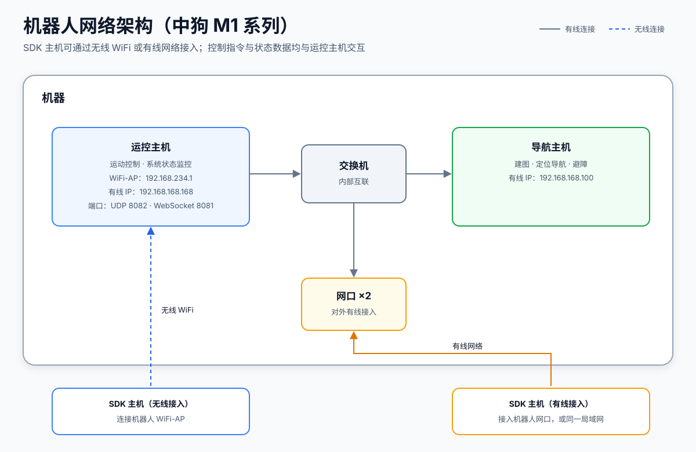

# SDK 网络架构图

> 适用范围：**中狗 M1 系列**。小狗 L2 系列的网络架构说明将在后续版本补充。

## 机器人内部网络组成

| 组件 | 主要职责 | 有线 IP |
|:--|:--|:--|
| 运控主机 | 运动控制、系统状态监控；SDK 的控制指令与状态数据均与其交互 | `192.168.168.168` |
| 导航主机 | 建图、定位导航、避障 | `192.168.168.100` |
| 交换机 | 运控主机、导航主机与对外网口之间的内部互联 | — |
| 网口 ×2 | 对外有线网络接入 | 由所在局域网分配 |

## SDK 主机连接方式

- **无线连接**：连接机器人 WiFi-AP，运控主机 AP 地址为 `192.168.234.1`。
- **有线连接**：通过机器人网口接入，与机器人处于同一局域网。
- **通信端口**（运控主机）：UDP `8082`、WebSocket `8081`。

建议优先使用有线连接，以获得更低的时延与更高的稳定性。
