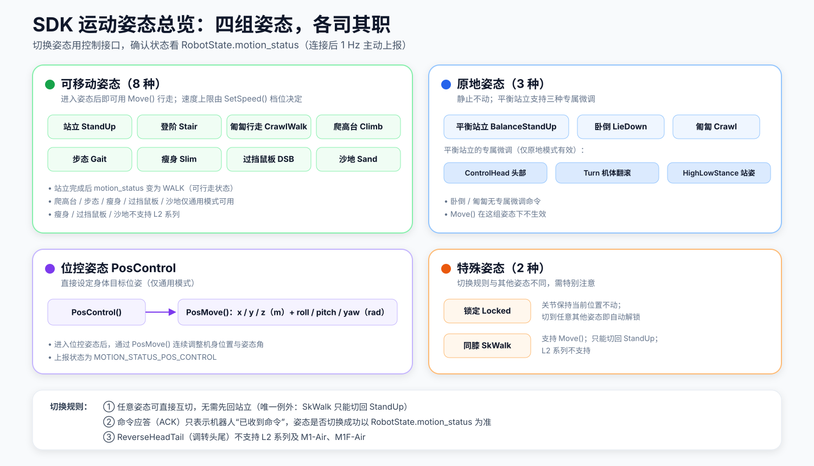
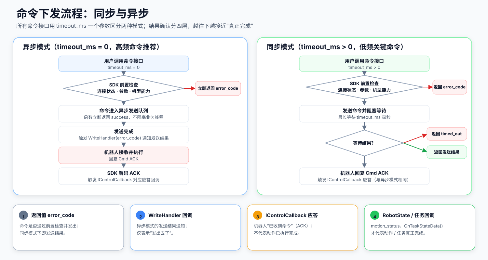

# SDK 运动状态与命令下发

## 运动状态（MotionStatus）是什么

可以把机器人的"姿态"理解为它身体的**工作模式**：站立、卧倒、匍匐、位控……
同一时刻机器人只处于一种姿态，姿态决定了它**能响应哪些运动命令**。

- **切换姿态**：调用姿态控制接口，如 `StandUp()`、`LieDown()`、`PosControl()`
- **观察姿态**：读取 `RobotState::motion_status`（连接后机器人以 1 Hz 主动上报，无需配置）

> **关键认知：命令应答（ACK）≠ 姿态切换完成。**
> 收到 `OnStandUp()` 只表示机器人"收到了站立命令"；姿态是否真的切换成功，
> 以 `RobotState::motion_status` 的上报为准。例如站立完成后上报的是 `MOTION_STATUS_WALK`
> （表示"已站好、可以走"），而不是停留在 `MOTION_STATUS_STAND_UP`。

## 姿态能力矩阵

| 姿态 | 切换接口 | 上报状态 MotionStatus | 移动能力 | 专属能力 / 备注 |
|:--|:--|:--|:--|:--|
| 站立 | `StandUp()` | `STAND_UP` → `WALK` | `Move()` | 完成后进入可行走状态 |
| 平衡站立 | `BalanceStandUp()` | `BALANCE_STAND` | — | `ControlHead()` 头部 / `Turn()` 翻滚 / `HighLowStance()` 站姿（原地模式） |
| 卧倒 | `LieDown()` | `LIE_DOWN` | — | — |
| 登阶 | `Stair()` | `STAIR` | `Move()` | — |
| 匍匐 | `Crawl()` | `CRAWL` | — | — |
| 匍匐行走 | `CrawlWalk()` | `CRAWL_WALK` | `Move()` | — |
| 爬高台 | `Climb()` | `CLIMB` | `Move()` | 仅通用模式 |
| 步态 | `Gait()` | `GAIT` | `Move()` | 仅通用模式 |
| 瘦身（过窄道） | `Slim()` | `SLIM` | `Move()` | 仅通用模式；L2 系列不支持 |
| 过挡鼠板 | `DSB()` | `DSB` | `Move()` | 仅通用模式；L2 系列不支持 |
| 位控 | `PosControl()` | `POS_CONTROL` | `PosMove()` | 仅通用模式 |
| 同膝 | `SkWalk()` | `SK_WALK` | `Move()` | 仅通用模式；**只能切回 `StandUp`**；L2 系列不支持 |
| 沙地 | `Sand()` | `SAND` | `Move()` | 仅通用模式；协议为 `action/snow`；L2 系列不支持 |
| 锁定 | `Locked()` | `LOCKED` | — | 切到任意其他姿态即自动解锁 |

> 在 L2 系列上调用不支持的接口时，SDK 不会发送命令，直接返回
> `robot_sdk::Errc::UnsupportedDeviceOperation`。各机型接口支持情况见
> [API 机型能力表](sdk_api_capability_zh.md)。

## 姿态切换规则

1. **任意姿态可直接互切**，无需先切回站立——唯一例外是 `SkWalk`，它只能切回 `StandUp`。
2. **锁定（Locked）后切换到任意其他姿态即自动解锁**，无需单独的解锁命令。
3. **站立完成上报 `WALK`**：`STAND_UP` 只出现在站立过程中。
4. **调转头尾（`ReverseHeadTail`）的机型限制**：L2 系列及 `DeviceType::M1_AIR`、`DeviceType::M1F_AIR` 不支持。
5. **沙地姿态的协议差异**：底层下发 `action/snow`，设备上报 `snow` 状态时，
   SDK 统一解析为 `MOTION_STATUS_SAND`。

## 命令下发与结果确认

所有命令接口通过 `timeout_ms` 一个参数区分两种工作模式：

| | 异步模式 | 同步模式 |
|:--|:--|:--|
| 参数 | `timeout_ms = 0`（默认） | `timeout_ms > 0` |
| 行为 | 立即返回，不阻塞 | 阻塞直到发送完成或超时 |
| 返回值含义 | 命令是否通过前置检查并受理 | 命令的发送结果 |
| 发送结果通知 | `WriteHandler` 回调 | 返回值本身 |
| 典型场景 | 高频命令（如 `Move` 周期发送）、回调函数内 | 低频关键命令（如姿态切换） |

结果确认分为四层，**越往下越接近"真正完成"**：

1. **返回值 `error_code`**：命令是否通过 SDK 前置检查（连接状态、参数合法性、机型能力）并发出。
2. **`WriteHandler` 回调**：异步模式下发送完成的通知，仍只表示"发出去了"。
3. **`IControlCallback` 应答（ACK）**：机器人确认"已收到命令"——不代表动作执行完毕。
4. **`RobotState` / `OnTaskStateData()`**：姿态、任务状态的实际变化，代表动作真正完成。

> **禁止在回调函数中使用同步模式**：同步等待需要 I/O 线程推进后续事件，
> 而回调本身就运行在 I/O 线程上，会造成死锁。详见 [回调接口文档](sdk_callback_zh.md)。

## 相关文档

- [SDKClient API 文档](sdk_client_api_zh.md) — 全部控制接口的参数与返回值
- [Callback 回调接口](sdk_callback_zh.md) — 应答与上报回调清单
- [数据类型文档](sdk_type_zh.md) — `MotionStatus`、`MachineStatus` 等状态枚举定义
- [API 机型能力表](sdk_api_capability_zh.md) — 各机型接口支持情况
