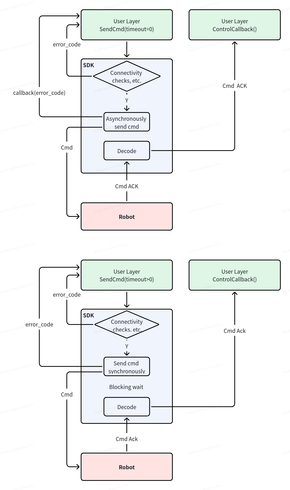

## SDK内部运动状态流转

**注意：锁定状态下切到其他状态下就算解锁。**

### SDK 姿态能力矩阵

> 所有姿态均支持直接切换。  

#### 姿态列表

| 姿态ID | 姿态名称 | 描述 | 可切换至 | 备注 | 
|---------|---------|---------|---------|---------|
| StandUp | 站立 | 站立后可移动 | 任意姿态 | 支持移动(Move) | 
| BalanceStandUp | 原地站立 | 站立后静止 | 任意姿态 | 支持上下左右摇摆(ControlHead)  支持机体翻滚(Turn) 支持高低身形(HighLowStance) |
| LieDown | 趴下 | 趴卧姿态 | 任意姿态 | - |
| Stair | 登阶姿态 | 站立后可移动 | 任意姿态 | 支持移动(Move) |
| Crawl | 匍匐姿态 | 匍匐后静止 | 任意姿态 | - |
| CrawlWalk | 匍匐行走姿态 | 匍匐后可移动 | 任意姿态 | 支持移动(Move) |
| Climb | 爬高台姿态 | 爬高台 | 任意姿态 | 支持移动(Move) |
| Gait | 步态姿态 | 精细化步态 | 任意姿态 | 支持移动(Move) |
| Slim | 过窄门姿态 | 过窄门 | 任意姿态 | 支持移动(Move) |
| DSB | 过挡鼠板姿态 | 过挡鼠板 | 任意姿态 | 支持移动(Move) |
| PosControl | 位控姿态 | 位置控制 | 任意姿态 | 支持位控移动(PosMove) |
| Locked | 锁定姿态 | 锁定 | 任意姿态 | 其他任意姿态可进行解锁操作 |
| SkWalk | 同膝姿态 | 同膝 | 只能切换至StandUp | 支持移动(Move) |

## SDK命令下发

图中表示两种命令下发设计

